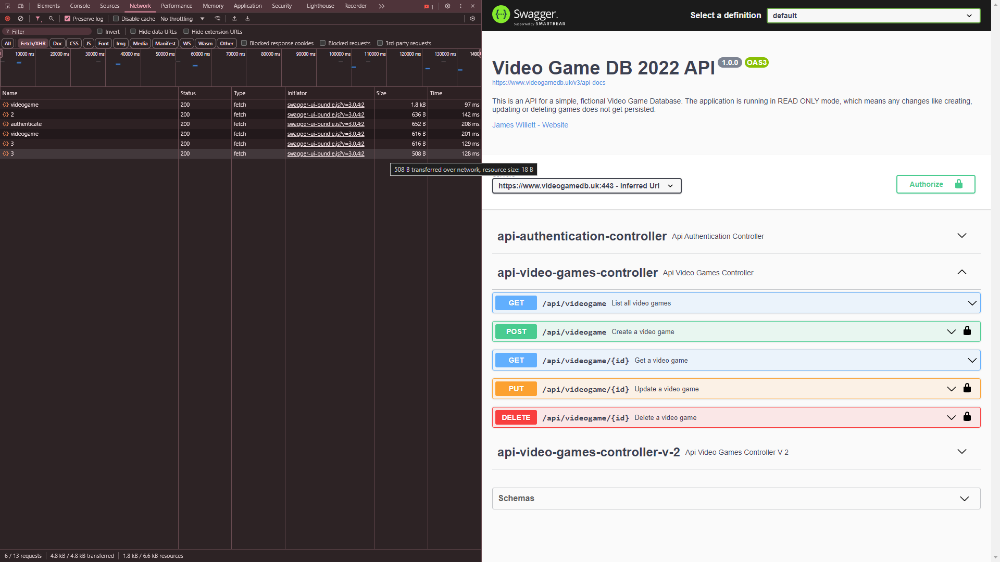
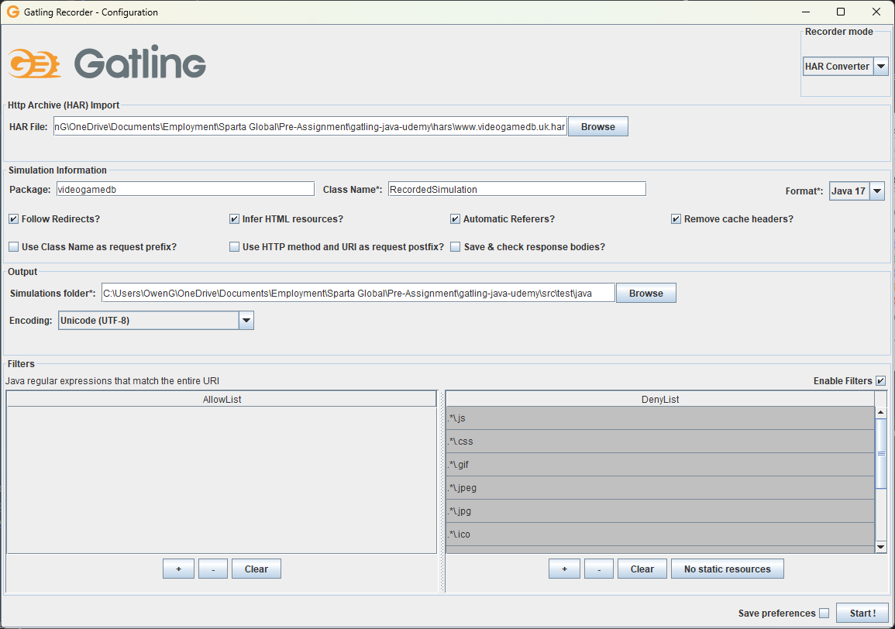
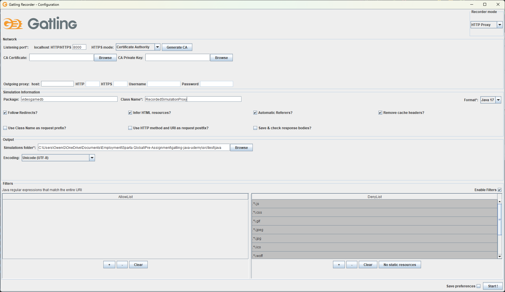

# Gatling Java Udemy Course

<!-- TOC -->
* [Gatling Java Udemy Course](#gatling-java-udemy-course)
  * [Notes](#notes)
    * [Gatling Recorder](#gatling-recorder)
      * [Using Swagger and Chrome Dev Tools](#using-swagger-and-chrome-dev-tools)
      * [Using Postman and a Proxy](#using-postman-and-a-proxy)
  * [Writing Gatling Scripts](#writing-gatling-scripts)
    * [Basic Test Anatomy](#basic-test-anatomy)
    * [Adding Pause Time](#adding-pause-time)
      * [Set Number of Seconds](#set-number-of-seconds)
      * [Within a Range of Seconds](#within-a-range-of-seconds)
      * [java.time.Duration Object](#javatimeduration-object)
    * [Assertions](#assertions)
      * [Example](#example)
      * [Use JSONPath to check response body](#use-jsonpath-to-check-response-body)
        * [Example](#example-1)
    * [Extract and Save Data from the Response into a Variable](#extract-and-save-data-from-the-response-into-a-variable)
      * [Example](#example-2)
    * [Debugging Gatling Session Variables](#debugging-gatling-session-variables)
      * [Example](#example-3)
    * [Refactor Gatling code into Methods](#refactor-gatling-code-into-methods)
      * [Example](#example-4)
    * [Looping HTTP Calls](#looping-http-calls)
      * [Example](#example-5)
    * [Feeders](#feeders)
      * [CSV Feeder](#csv-feeder)
        * [Example](#example-6)
      * [JSON Feeder](#json-feeder)
        * [Example](#example-7)
      * [Basic Custom Feeder](#basic-custom-feeder)
<!-- TOC -->

## Notes

### Gatling Recorder

#### Using Swagger and Chrome Dev Tools

[Swagger page](https://www.videogamedb.uk/swagger-ui/index.html#/)

- Use Chrome Dev Tools to record the requests made in the Swagger UI



- Download the requests as a HAR file

> right click on any of the requests > Save as HAR with content

- Run the Gatling Recorder

```
mvn exec:java
```



- Set recorder mode as HAR Converter
- Select the HAR file downloaded from Chrome
- Choose an appropriate package name
- Click `No static recourses` at the bottom to add all static recourses to the DenyList filter
- Click `Start!` and the scripts will be generated in the package specified

#### Using Postman and a Proxy

- Run the Gatling Recorder

```
mvn exec:java
```



- Set recorder mode as HTTP Proxy
- Set HTTPS mode as Certificate Authority and click `Generate CA`
- Save the certificate somewhere on your machine
- Open the settings window in Postman and navigate to Certificate
- Select the certificate you generated in the Gatling Recorder.
- Navigate to proxy settings
- Tick the `Use custom proxy configuration` option
  - Set the IP as 127.0.0.1 and the port as the one selected in the Gatling Recorder
- In the Gatling Recorder, click `Start!` to start the recorder
- Make the requests you want to record in Postman
- Once finished, click `Stop and Save` and the scripts will be generated in the package specified

## Writing Gatling Scripts

To make a Java class into a Gatling script we extend the class `Simulation` from _io.gatling.javaapi.core_.

### Basic Test Anatomy

```java
public class MyFirstTest extends Simulation{
    // Http Configuration
    private HttpProtocolBuilder httpProtocol = http
            .baseUrl("https://videogamedb.uk/api")
            .acceptHeader("application/json");

    // Scenario Definition
    private  ScenarioBuilder scenario = scenario("My First Test")
            .exec(http("Get all games")
                    .get("/videogame"));

    // Load Simulation
    {
        setUp(
                scenario.injectOpen(atOnceUsers(1))
        ).protocols(httpProtocol);
    }
}

```

### Adding Pause Time

Use the `.pause()` method to add pauses to tests. You can specify whether to pause for a set number of seconds, a random number of seconds within a given range, or a java.time.Duration object. 

#### Set Number of Seconds

```java
.exec(http("Get all video games - 1st call")
        .get("/videogame"))
.pause(5) // Pause for 5 seconds
```

#### Within a Range of Seconds

```java
.exec(http("Get specific game")
        .get("/videogame/1"))
.pause(1,10) // Pause for a random number between 1 and 10 seconds   
```

#### java.time.Duration Object
```java
.exec(http("Get all video games - 2nd call")
        .get("/videogame"))
.pause(Duration.ofMillis(4000)); // Pause for 4000 milliseconds
```

### Assertions

We use the `.check()` method to make assertions on responses.

#### Example

```java
.exec(http("Get all video games - 1st call")
        .get("/videogame")
        .check(status().is(200))) // Check the status code of the response is 200
.pause(5) // Pause for 5 seconds
```

#### Use JSONPath to check response body

We can use JSONPath to make assertions about the response body

##### Example

```java
.exec(http("Get all video games - 1st call")
        .get("/videogame")
        .check(jsonPath("$[?(@.id==1)].name").is("Resident Evil 4"))) // Check the name attribute of the second element in the list is Resident Evil 4
.pause(5) // Pause for 5 seconds
```

### Extract and Save Data from the Response into a Variable

We use the `saveAs()` method to save data into a variable.

#### Example

```java
.exec(http("Get all video games - 2nd call")
        .get("/videogame")
        .check(jsonPath("$[1].id").saveAs("gameId"))) // Save the id of the game at index 1 as a variable called "gameId"
.pause(Duration.ofMillis(4000)) // Pause for 4000 milliseconds

.exec(http("Get specific game with ID - #{gameId}")
        .get("/videogame/#{gameId}")
        .check(jsonPath("$.name").is("Gran Turismo 3"))); // Check that the name of the game with Id stored in the variable gameId is "Gran Turismo 3"
```

### Debugging Gatling Session Variables

We can use the Session API to retrieve session variables.

#### Example

```java
.exec(
        session -> {
            System.out.println(session); // Print all session variables
            System.out.println("gameId set to: " + session.getString("gameId")); // Print the gameId session variable
            return session;
        }
)
```

### Refactor Gatling code into Methods

We make ChainBuilder objects to act as methods and reuse them in the ScenarioBuilder exec() calls.

#### Example

```java
private static ChainBuilder getAllVideoGames =
        exec(http("Get all video games")
                .get("/videogame")
                .check(status().not(404), status().not(500)));

private static ChainBuilder getSpecificVideoGame =
        exec(http("Get specific video game")
                .get("/videogame/1")
                .check(status().in(200)));

private ScenarioBuilder scn = scenario("Video Game Db - Section5 code")
        .exec(getAllVideoGames)
        .pause(5)
        .exec(getSpecificVideoGame)
        .pause(5)
        .exec(getAllVideoGames);
```

### Looping HTTP Calls

We use the `repeat().on()` method to loop a HTTP call.

#### Example

```java
private static ChainBuilder getSpecificVideoGame =
        repeat(5,"myCounter").on( //Make this call 6 times, incrementing the value of myCounter each time
                exec(http("Get specific video game")
                        .get("/videogame/#{myCounter}")
                        .check(status().in(200)))
        );
```

Alternatively we can add the repeat call to the ScenarioBuilder:

```java
private ScenarioBuilder scn = scenario("Video Game Db - Section5 code")
        .repeat(2).on(
                exec(getAllVideoGames)
        );
```

### Feeders

#### CSV Feeder

We can use  Gatling Core's FeederBuilder Class and `feed()` method to feed data from a CSV file to calls.

##### Example

```java
private static FeederBuilder.FileBased<String> csvFeeder = csv("data/gameCsvFile.csv").circular(); // Read from the file data/gameCsvFile.csv and store the data in session variables

private static ChainBuilder getSpecificGame =
        feed(csvFeeder) // Use csvFeeder to loop the call using the data from the file as session variables
                .exec(http("Get video game with name - #{gameName}")
                .get("/videogame/#{gameId}")
                        .check(jsonPath("$.name").isEL("#{gameName}")));
```

#### JSON Feeder

Very similar to CSV Feeder

##### Example

```java
private static FeederBuilder.FileBased<Object> jsonFeeder = jsonFile("data/gameJsonFile.json").circular();
```

#### Custom Feeder

We can generate data to feed to our requests using normal Java code, such as random numbers.

##### Example 

```java
// Create a feeder of random video games
private static Iterator<Map<String, Object>> customFeeder =
        Stream.generate((Supplier<Map<String, Object>>) () -> {
            Random rand = new Random();
            int gameId = rand.nextInt(10 - 1 + 1) + 1;

            String gameName = RandomStringUtils.randomAlphabetic(5) + "-gameName";
            String releaseDate = randomDate().toString();
            int reviewScore = rand.nextInt(100);
            String category = RandomStringUtils.randomAlphabetic(5) + "-category";
            String rating = RandomStringUtils.randomAlphabetic(4) + "-rating";

                    HashMap<String, Object> hmap = new HashMap<String, Object>();
                    hmap.put("gameId", gameId);
                    hmap.put("gameName", gameName);
                    hmap.put("releaseDate", releaseDate);
                    hmap.put("reviewScore", reviewScore);
                    hmap.put("category", category);
                    hmap.put("rating", rating);
                    return hmap;
        }
        ).iterator();

private static ChainBuilder createNewGame =
        feed(customFeeder)
                .exec(http("Create New Game - #{gameName}")
                        .post("/videogame")
                        .header("Authorization", "Bearer #{jwtToken}")
                        .body(ElFileBody("bodies/newGameTemplate.json")).asJson() // Convert the data from the feeder to JSON using a template
                        .check(bodyString().saveAs("responseBody")))
                .exec(session -> {
                  System.out.println(session.getString("responseBody"));
                  return session;
                });
```

> Here our JSON template comes from the file `bodies/newGameTemplate.json`, which you can find below:

```json
{
  "id": #{gameId},
  "name": "#{gameName}",
  "releaseDate": "#{releaseDate}",
  "reviewScore": #{reviewScore},
  "category": "#{category}",
  "rating": "#{rating}"
}
```

### Load Simulation

_In real-world situations, we would use data about the SUT's past usage to build load profiles._

#### Open vs Closed Workload Models

When it comes to load models, systems behave in 2 different ways:

- **Open** systems, where you control the arrival rate of users
- **Closed** systems, where you control the concurrent number of users

#### Basic Load Simulation

We use the `.atOnceUsers()` method to inject a given number of concurrent users, and combine the use of `.rampUsers()` and `.during()` to inject users over time.

##### Example

```java
setUp(
        scn.injectOpen(
                nothingFor(5), // Do nothing for 5 seconds
                atOnceUsers(5), // Add 5 users all at once
                rampUsers(10).during(20) // Add another 10 users over 20 seconds
        ).protocols(httpProtocol)
);
```


